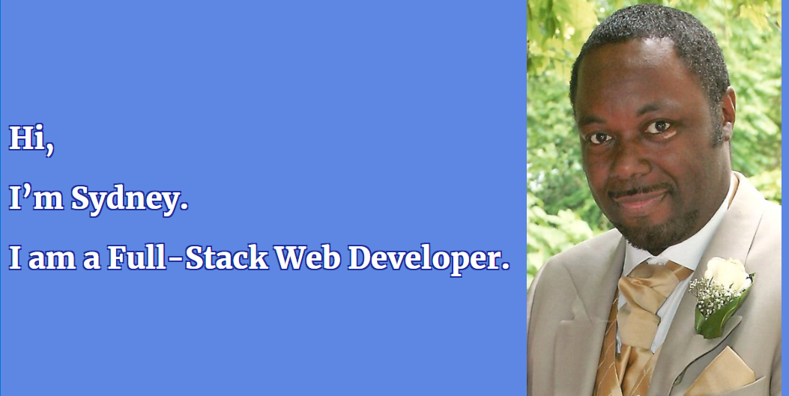

<!--
**sydneymurray/sydneymurray** is a ✨ _special_ ✨ repository because its `README.md` (this file) appears on your GitHub profile.
-->

After spending many years as a Network Engineer and an IT Technician, I was made redundant due to the pandemic, due to my passion for coding I decided to embark on a journey and try my skills at Software Development, first with Boolean for JavaScript, Node.JS then with Nology for JAVA.

Now. I can conceive, design and build websites from conception through to the design stage, with user stories, wire-frame diagrams, I can determine & design database models utilizing SQL also design and build a back end server application right through to the front end client application.

- 🎓 Experience: Full stack Nology consultant developer [_nology](https://nology.io/).   
- 💻 1000+ hours of coding.   
- 👩🏻‍💻 7 hours coding/day.  
- 👩🏻 Looking for Full Stack React, Node.JS or JAVA roles as a Junior Web Developer.  
- 🗺 I love music mixing, football, gaming, SCI-FI & travelling.  

## Contact Me

<a href="https://www.linkedin.com/in/sydney-murray-b2924a24/">
     </img>
</a>

## My stack

      HTML |

      CSS |

      SCSS | 

      JavaScript | 

      React |

      TypeScript |

      Node.JS 

      JAVA 

  

